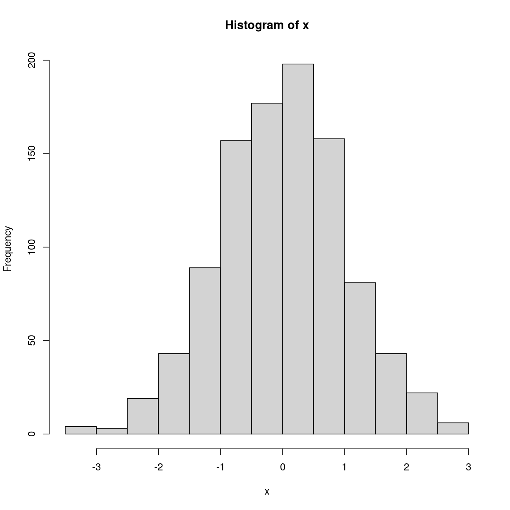
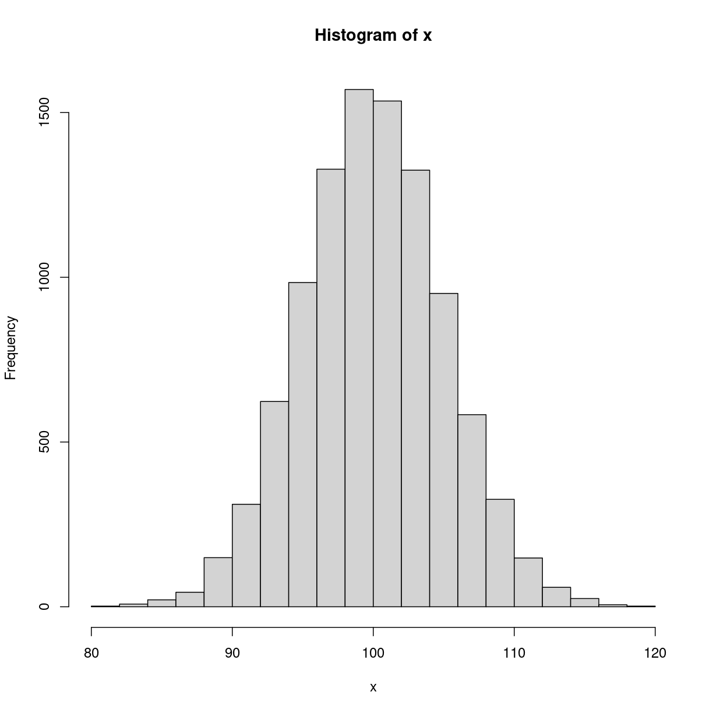

---
# Please do not edit this file directly; it is auto generated.
# Instead, please edit 01-prequel.md in _episodes_rmd/
title: "Getting started with R and RStudio"
author: "Greg Tucker-Kellogg"
date: "January 21, 2019"
source: Rmd
output: 
  html_document:
    fig_caption: yes
teaching: 5
exercises: 5
objectives:
- "Understand and describe two ways of using R interactively: The R console and RStudio"
- "Be able to create an R script in RStudio and send R commands to the R console"
- "Be able to use the basic R help system in R and RStudio"
questions:
  - "What benefits does an IDE like RStudio have over a command-line interface like the R Console?  Are there any disadvantages"
  - How would you run an R script from the bash command line?
keypoints:
  - R is a general purpose programming language; both the R console and RStudio are interfaces to R
  - RStudio has features that help R users control and document their activities.
  - The RStudio script editor allows users to send code line by line to the console using <kbd>Control-Enter</kbd>
  - R has an extensive help system.
---

## What is R?

[**R**](https://www.r-project.org) is a high-level programming language that is extensively used by
statisticians and bioinformaticians. While R is a general purpose
programming language, R is designed to work with data, and is heavily used
in the *data science* community.

Additionally, R is an *interpreted* language, which means that code written in R
will be executed by a command interpreter instead of requiring compilation (as is the case
with compiled languages such as **C** or **Java**). Interpreted languages are especially
convenient for real-time problem solving and rapid prototyping.

Use of R has increased substantially over the last few years in large part due to the
growth in data intensive fields and data science. Hence, knowing how to work in R is
becoming increasingly important, and will be the main language we will work in for
analysis of genomic data.

### R features

Various features of R makes it attractive for data analysis. These includes the following:

1. R is open-source, which means both that algorithms and methods can be checked for
   validity, and that users of R contribute to the code base and development of new
   packages.
1. R runs on all major computer platforms.
2. R can be extended using *packages*.
4. R is free software (as in free speech, not free beer), available under the [GNU General Public
   License][GPL] version 2 or greater.  R packages may be distributed under different
   license terms.
5. R has outstanding graphics and data visualisation capabilities, supporting publication
   quality graphs/figures.
6. R has an active community of users and developers, which facilitates the ease of
   getting help from others.

### Disadvantages of R

Life is full of tradeoffs, and not everything about R is an unambiguous advantage over
other choices.

- Code written in R runs much slower than code written in C or Java. (However, writing
  code usually takes much longer than running it, so this is often not a concern).
- R has a somewhat quirky language syntax, and is sometimes seen as an inconsistent
  language. R is often accused of violating the [Principle of Least Astonishment](https://en.wikipedia.org/wiki/Principle_of_least_astonishment).
  

## The R Console

One way to run R is inside bash. Try running R from either an open shell window (type `R`) or from the window launcher. In either case, you should wind up at a console window that looks something like this:

**The R Console** is your basic R interface, provided by the language itself. There is a prompt, but it's no longer the bash prompt `$ `, it's the R prompt `> `. When R starts, it tells you what version of the R program is running and what kind of hardware you are using to run it.

R can be used as a fancy calculator: you can get output just by typing some math at the console, like this:

~~~
# This is some R input. A line that begins with # is a comment
# 22/7 is pretty close to pi, but it's not pi!
22/7
~~~
{: .language-r}

~~~
[1] 3.142857
~~~
{: .output}

~~~
# it's silly to estimate the value of pi as a fraction; R already defines a value for pi
pi
~~~
{: .language-r}

~~~
[1] 3.141593
~~~
{: .output}

In these episodes, we can distinguish the input (what you type at the console) from what the R language returns by the color coding on the left.

you can perform a lot of actions at the prompt. Try this, and see a plot similar to what is shown below

~~~
x <- rnorm(1000)
hist(x)
~~~
{: .language-r}

- The first line generates 1000 random data points sampled from a normal (Gaussian) distribution with mean 0 and standard deviation 1. This data is then assigned to a variable `x` with the assignment operator `<-`. (Many other languages use `=` for assignment, which works in R, but there are good reasons to use `<-`.

- The second line plots a histogram of `x`. If you use the R console, the plot will open up in a separate window.

## RStudio

R is the language and interpreter, whereas [RStudio][rstudio] is a professional
development environment that includes a code editor, debugging tools, and a server
available from a browser. A screenshot of the RStudio interface is shown below. We
encourage the use of RStudio as an interface to R.

In RStudio, the console, graphics, help windows, scripts, and a data explorer tool are all integrated into one graphical interface. 

> ## Try it!
> 
> Run the following in the R Console window in RStudio:
> 
> ~~~
> x <- rnorm(1000)
> hist(x)
> ~~~
> {: .language-r}
> 
> You can type R commands just like at the bash command line: each time you hit <kbd>Enter</kbd> you will send a command to the R interpreter.
>
> What happens?
>
> > ## Solution
> > - You may notice that when you type <kbd>(</kbd> RStudio automatically adds the <kbd>)</kbd> and positions the cursor appropriately.
> > - Your plot will open up in a subwindow on the right, not a new window as it would if you were using the console.
> > 
> {: .solution}
{: .challenge}

### R's help system

- Functions like `rnorm` can perform a lot of activities depending on their parameters. To get help on any R function, type `?name` for the function name. For example, if you want to find out about the normal distribution functions like `rnorm`, type `?rnorm`.  Try that now.

- If you are unsure of the function you are looking for, try `??name` on a function to get a list of possibilities.

- Weirdly enough, even operators like `+` and `?` are really functions in R, but to get help you need to enclose them in backticks. Try  <code>?`+`</code>

- R's help system is extensive, and we've just scratched the surface of what it can do.

> ## Changing the sample distribution
> 
> Using RStudio, create a new R script. Enter code into the script to create a few lines of R code
> to sample a normal distribution with mean 100 and standard deviation 5 (hint: use `?rnorm` to
> figure this out), and plot a histogram of the results. Use <kbd>Ctrl-Enter</kbd> to send each
> line from the script editor to the console.
> 
> > ## Solution
> >  Let's sample a large number of points to get a good smooth distribution. 
> > 
> > ~~~
> > x <- rnorm(n=10000,mean=100,sd=5)
> > hist(x)
> > ~~~
> > {: .language-r}
> > 
> > 
> {: .solution}
> 
{: .challenge} 

## Our last preparation step before moving on

1.  Using RStudio, create a New Project (File -> New Project) in a new directory (I suggest the Desktop). Call the project whatever you want. 
2. Under the Files tab on the right (!), create a new folder called "data". We will use this later in the session.


